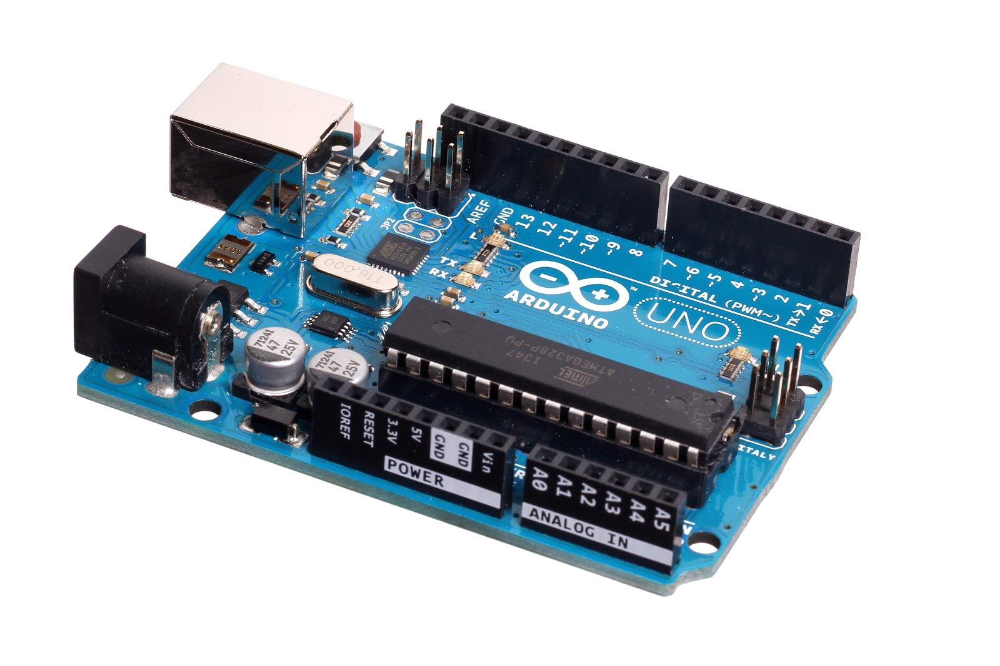
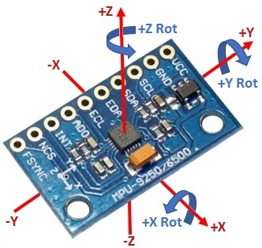
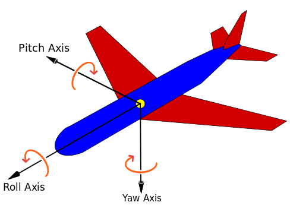

# Visualizing-3D-motion-of-imu

[Project Video](https://drive.google.com/file/d/1Bs3iMq1NH06NUPIHAe1c0rc94L0OgWDq/view?usp=sharing)

The precise tracking of human operators in robotic workplaces is an important requirement  to be satisfied in order to develop human-robot interaction tasks more smoothly. Inertial Measurement Unit (IMU) is one of the technologies capable of estimating orientation of rigid body. IMU uses information from 3 sensors viz., gyroscope,accelerometer and magnetometer to calculate orientation.
In this project we integrate  IMU sensor with arduino to obtain sensor reading,which are then fed to processing IDE for visualizing motion of IMU.

#### Components Used

#### SETUP:

* HARDWARE:              

  1.Arduino UNO ||  2.MPU 9250  || 3.Jumper wires
  
* SOFTWARE:

  1.Arduino IDE || 2.Processing IDE

#### About MPU 9250 sensor
The MPU-9250 combines a 3-axis accelerometer, a 3-axis gyroscope and a 3-axis magnetometer with an on-board Digital Motion Processor (DMP) all packaged module.With its dedicated I2C sensor bus, the MPU-9250 directly provides complete 9-axis MotionFusion output. In this project we are using MPU9250 to get Real-time motion data from it.

* USES OF DIFFERENT PINS OF MPU 9250: *

1.VCC =  5V nominal.  Connect to 5V output of the MCU   

2.GND = Ground  

3.SCL =   Clock (SCL / SCK) for I2C and SPI  

4.SDA =  Data (SDA / SDI) for I2C and SPI 

5.EDA = Auxiliary I2C bus (SDA) for connecting external sensors

6.ECL =  Auxiliary I2C bus (SCL) for connecting external sensors   

7 .ADO = Address select for I2C / SDO for SPI interface    

8.INT =   Interrupt Output   

9.NCS = SPI Chip Select   

10.FSYNC 10.FSYNC = Frame Sync

#### WORKING

##### Measuring Acceleration:
It measures acceleration using its on-chip accelerometer with four programmable full scale ranges of ±2g, ±4g, ±8g and ±16g that can be set by the user.The X, Y and Z are relative to how the chip sits on the module as shown to the right and will ultimately be dependent on the orientation of the module in your project.
##### Measuring Rotation:
It measures rotation using its on-chip gyroscope with four programmable full scale ranges of ±250°/s, ±500°/s, ±1000°/s and ±2000°/s that can be set by the user. The axis of rotation are relative the the X,Y and Z shown to the right.
##### Measuring Compass Direction:
The MPU-9250 chip includes the AK8963 magnetometer  that can measure compass direction that allows the device to know its orientation relative to the magnetic north similar to how a hand-held compass works.The axis are X,  Y and Z are the same as shown to the right for the accel and gyro except that the Z-axis is reversed. So +Z is in the direction going down toward earth.
##### Using the I2C Interface:
The module uses I2C interface for communications with MCU.It supports two different I2C addresses;0x68 and 0x69.That allows two devices to be used on the same bus or in case there is an address conflict with another device on the bus.
The AD0 pin determines the I2C address to use.This pin has built in 4.7k pull-down resistor on module.if the pin is left unconnected,the line will be pulled low and the default I2C address will be 0X68.To select 0x69, connect the ADO pin to 3.3V.
The SCL and SDA pins connect to A5 and A4 pins in analog input pins on the arduino board.
The Auxiliary I2C address with pins labeled EDA and ECL are an I2C bus controlled by the MPU-9250 so that it can communicate directly with other sensors so that it can get additional information for its internal computations.

#### Roll, Pitch and Yaw
Flight dynamics is the science of air vehicle orientation and control in three dimensions. The three critical flight dynamics parameters are the angles of rotation in three dimensions about the vehicle's center of gravity (cg), known as pitch, roll and yaw.                                                                                                                       Roll, pitch and yaw refer to rotations about the respective axes starting from a defined steady flight equilibrium state.

##### FORMULAE OF ROLL, PITCH & YAW:
1.Accelerometer measures and tells the amount of force (acceleration) it is experiencing in X, Y and Z direction. Based on the orientation of IMU, it will experience different amounts of acceleration along the three axes. These acceleration values can give us roll ,pitch values using below formula:

`pitch = 180 * atan2(accelX, sqrt(accelY*accelY + accelZ*accelZ))/PI `     

`roll = 180 * atan2(accelY,sqrt(accelX*accelX + accelZ*accelZ))/PI`

2.Magnetometer measures magnetism. It is able to help us find orientation using the earth’s magnetic field, similar to a compass.Using X,Y,Z obtained from magnetometer ,yaw reading is calculated by below formula:

`Mag_x = magReadX*cos(pitch)+magReadY*sin(roll)*sin(pitch)+magReadZ*cos(roll)*sin(pitch)` 

`mag_y = magReadY * cos(roll) - magReadZ * sin(roll)  `                                                                                 

`yaw = 180 * atan2(-mag_y,mag_x)/PI`

3.Gyroscope measures the angular velocity along the three axes. So it is not directly able to predict roll, pitch or yaw. But as we can see integrating angular velocity over time gives us the angle, which can be used to measure the change in roll, pitch and yaw.

#### Block Diagram:

#### PROCEDURE

1.Install Arduino IDE and Processing IDE.

2.Make the hardware connections as shown in the figure.

3.Dump the interfacing code in Arduino UNO using Arduino IDE.

4.After interfacing imu with the arduino, it starts sending sensor readings to the Arduino board.Using sensor readings final values of  pitch, roll, yaw are calculated The values obtained from Arduino are then fed to the processing IDE which will rotate and translate the 3D object on screen of the processing IDE accordingly.                

#### RESULTS                                                                                                                         

We studied the components of IMU. They are: accelerometer, gyroscope, magnetometer.            

More specifically,  we studied the variations of the IMU readings when we moved the sensor. We made the following observations:  

Here,  xa,ya,za are linear acceleration along X,Y,Z resp.                                                                                     
xg,yg,zg are angular acceleration about X,Y,Z resp.

P.S: The X,Y and Z directions are taken as per the marking on the sensor.
The readings were observed on the serial monitor of the Arduino IDE.

#### WHAT WE LEARNT
From this project we learnt the following things:

* Communication between arduino IDE and Processing IDE.

* Writing code in Arduino IDE and Processing IDE.

* Interfacing between Arduino and IMU sensor.

* IMU reading variation with various movements.
 
#### CONCLUSION
We successfully visualised the 3D motion of the IMU sensor. Also we understood the working of the IMU sensor. In future, we can apply the knowledge we gained in control Systems projects.

#### Results:

